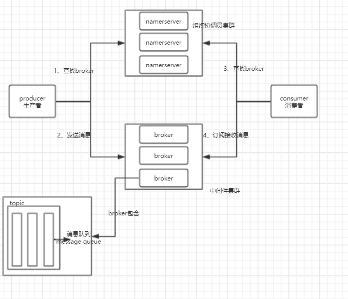

# rocketMQ

是采用Java语言开发的分布式的消息系统

### 一、核心概念

1. producer（生产者）：
   - 消息生产者，负责产生消息，一般由业务系统产生消息；
   - producer group：一类producer的集合名称，这类producer通常发送一类消息，且逻辑一致。
2. consmer
   - 消息消费者，负责消费消息，一般是后台系统负责异步消费；
   - push consumer：服务器向消费者端推送消息；broker主动推送
   - pull consumer：消费者向服务定时拉取消息，consumer主动拉取
   - consumer group：一类consumer的集合名称，这类consumer通常消费一类消息，且消费逻辑一致。
3. nameserver
   - 集群架构中的组织协调员
   - 收集broker的工作情况
   - 不负责消息的处理
4. broker
   - 是rocketMQ的核心负责消息发送、接收、高可用（真正干活的）
   - 需要定时发送自身情况到nameserver，默认10秒发送一次，超过两分钟会认为该broker失效
5. topic
   - 不同类型的消息一不同的topic名称区分，如user，order等
   - 是逻辑概念
   - message queue：消息队列，用于存储消息