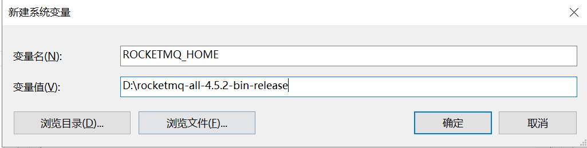

# rocketMQ安装

### 一、win10安装

RocketMQ需要64位的JDK，请确保是64位系统并安装的是的64位JDK。本地配置好了Maven环境（非必需）。
下载文件：
下载地址：http://rocketmq.apache.org/dowloading/releases/，选择Binary文件下载；

#### 设置环境变量

下载完成后解压到自己向安装的目录。

**设置环境变量：**

变量名：`ROCKETMQ_HOME`
变量值：`D:\rocketmq-all-4.5.2-bin-release`

**启动`nameserver`**

进入rocketmq的bin文件夹，按着Shift键右击鼠标打开命令窗口，然后执行：**start mqnamesrv.cmd**

出现下图代表启动完成：

`注意：`此时窗口不可关闭

**启动`broker`**

在刚才的命令窗口继续执行：**start mqbroker.cmd -n 127.0.0.1:9876 autoCreateTopicEnable=true**，
启动成功：

`注意：`此时窗口只要不报错，没有打印任何信息都是启动成功，此时的窗口也不可关闭；

此时已经安装完成。