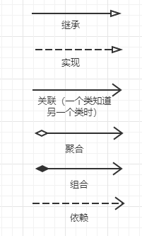
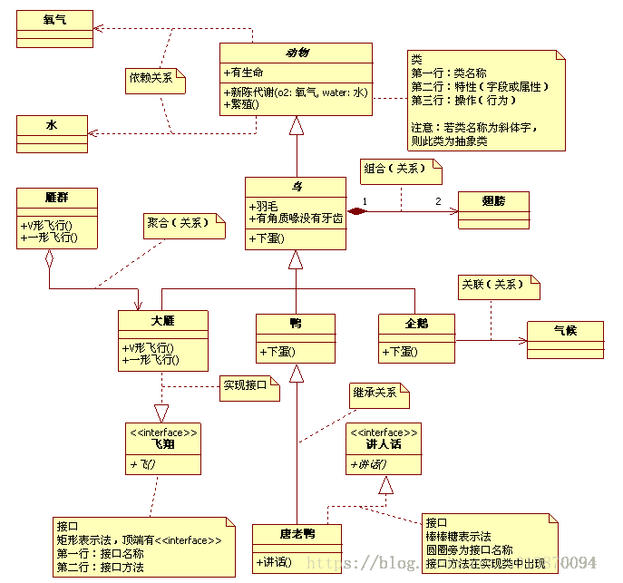
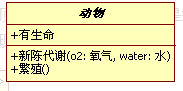
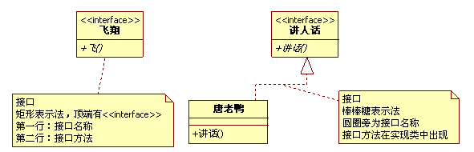
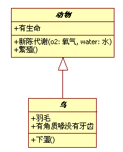
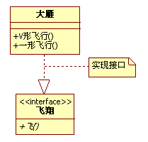
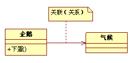
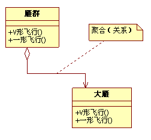
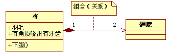
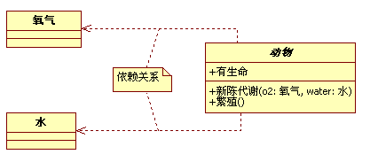

# UML时序图

时序图中集中基础线条：

- 类图

  首先，看动物矩形框，它代表一个类（Class）。类图分三层，第一层显示类的名称，如果是抽象类，则就用斜体显示。第二层是类的特性，通常就是字段和属性。第三层是类的操作，通常是方法或行为。前面的符号，+ 表示public，- 表示private，# 表示protected。

  

- 接口图

  类图的区别主要是顶端的<>显示。第一行是接口名称，第二行是接口方法。接口还有另一种表示方法，俗称棒棒糖表示法。唐老鸭是能讲人话的鸭子，实现了讲人话的接口。

  

- 继承

  注意动物、鸟、鸭、唐老鸭之间的关系符号。它们都是继承的关系，继承关系用空心三角形 + 实线来表示的。

  

- 实现

  上述所列举的几种鸟中，大雁最能飞，让它实现了飞翔接口。实现接口用空心三角形 + 虚线来表示。

  

- 关联

  企鹅和气候两个类，企鹅是很特别的鸟，会游不会飞。更重要的是，它与气候有很大的关联。我们不去讨论为什么北极没有企鹅，为什么它们要每年长途跋涉。总之，企鹅需要知道气候的变化，需要了解气候规律。当一个类知道另一个类时，可以用关联（association）。关联关系用实线箭头来表示。

  

- 聚合

  再来看大雁和雁群这两个类，大雁是群居动物，每只大雁都是属于一个雁群，一个雁群可以有多只大雁。所以它们之间就满足聚合（Aggregation）关系。聚合表示一种弱的拥有关系，体现的是A对象可以包含B对象，但B对象不是A对象的一部分。聚合关系用空心的菱形 + 实线箭头来表示。

  

- 组合

  组合（Composition）是一种强的拥有关系，体现了严格的部分和整体的关系，部分和整体的生命周期一样。在这里鸟和其翅膀就是组合关系，因为它们是部分和整体的关系，并且翅膀和鸟的生命周期是相同的。组合关系用实习的菱形 + 实线箭头来表示。另外，你会注意到合成关系的连线两端还有一个数字1和数字2，这被称为基数。表明这一端的类可以有几个实例，很显然，一个鸟应该有两只翅膀。

  

- 依赖

  动物的几大特征，比如有新陈代谢，能繁殖。而动物要有生命力，需要氧气、水以及食物等。也就是说，动物依赖于氧气和水。他们之间是依赖关系（Dependency），用虚线箭头来表示。

  