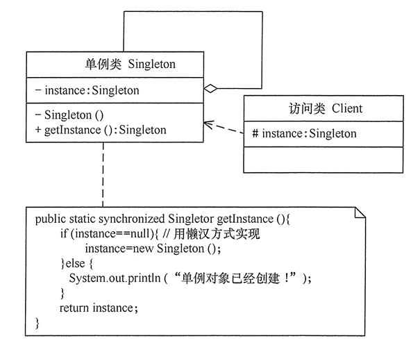

# 单例模式

> @author huangdailin

在有些系统中，为了节省内存资源、保证数据内容的一致性，对某些类要求只能创建一个实例，就是`单例模式`；

### 一、定义与特点

`单例模式的定义`：指一个类只有一个实例，且该类能自行创建这个实例的一种模式。比如，Windows中只能打开一个任务管理器，可以避免因为打开多个任务管理器窗口而造成的资源浪费，或者出现各个窗口显示内容不一致的错误。

`常见的单例`：在计算机系统中，Windows的回收站、操作系统中的文件系统、多线程中的线程池、显卡中的驱动程序对象、打印机的后台处理服务、应用程序的日志对象、数据库的连接池、网站的计数器、web应用的配置对象、应用程序的对话框、系统中的缓存等；

`单例模式的特点：`

1. 单例类只有一个实例对象；
2. 该单例对象必须是由单例类自行创建；
3. 单例类对外提供一个访问该单例的全局访问点；

### 二、结构与实现

单例模式是设计模式中最简单的模式之一。通常，普通类的构造函数是公有的，外部类可以通过`new 构造函数()`来生成多个实例。但是，如果将类的构造函数设为私有的，外部类就无法调用该构造函数，也就没有办法生成多个实例。这时候该类本身必须要`定义一个静态私有实例`，并且向外提供一个`静态的公有函数`用于创建或者获取该静态私有实例。

#### 1）单例模式的结构

单例模式的主要角色如下：

- 单例类：包含一个实例并且能够自行创建这个实例的类；
- 访问类：使用该单例的类。

类图如下所示：



#### 2）单例模式的实现

##### 1.`懒汉式单例`

这种模式的特点是类加载的时候没有生成单例，只有当第一次调用`getInstance()`方法时才会去创建这个单例。代码如下：

```java
public class LazySingleton {
    /**
     * 保证instance在所以线程中同步
     */
    private static volatile LazySingleton instance = null;

    /**
     * private 避免在外部被实例化
     */
    private LazySingleton() {}

    /**
     * 静态公有方法
     *
     * @return 实例对象
     */
    public static synchronized LazySingleton getInstance() {
        if (instance == null) {
            instance = new LazySingleton();
        }
        return instance;
    }
}
```

`注意：`如果编写的是多线程程序，不能删除代码中的`volatile`和`synchronized`关键字，否则将会存在`线程非安全`的问题。有了两个关键字就能够保证线程安全，但是每次访问时都要同步，会影响性能，这就是懒汉式单例的缺点。

##### 2.`饿汉式单例`

这种模式的特点是一旦类被加载，保证在调用`getInstance()`方法之前单例就已经存在了。代码如下：

```java
public class HungrySingleton {
    /**
     * 类加载就创建单例
     */
    private static final HungrySingleton instance = new HungrySingleton();

    /**
     * 私有构造方法
     */
    private HungrySingleton(){}

    /**
     * 静态公有方法
     *
     * @return 实例对象
     */
    public static HungrySingleton getInstance() {
        return instance;
    }
}
```

`注意：`饿汉式单例模式在类创建时就已经创建好了一个静态的对象供系统使用，以后不会再改变，所以是`线程安全的`，可以直接用于多线程而不会出现问题。`缺点：`因为一开始就初始化，容易产生垃圾。

##### 3.`静态内部类单例`

只有第一次调用`getInstance()`方法时，虚拟机才加载 `Inner` 并初始化`instance` 。代码如下：

```java
public class InnerSingleton {
    /**
     * 私有构造方法
     */
    private InnerSingleton() {}

    /**
     * 静态内部类
     */
    private static class Inner {
        private static final InnerSingleton instance = new InnerSingleton();
    }

    /**
     * 静态公有方法
     *
     * @return 实例对象
     */
    public static InnerSingleton getInstance() {
        return Inner.instance;
    }
}
```

`注意：`只有一个线程可以获得对象的初始化锁，其他线程无法进行初始化，保证对象的唯一性。目前此方式是所有单例模式中`最推荐的模式`，但具体还是根据项目选择。

### 三、应用场景

根据单例模式的结构和特点，下面是适用的场景的特点

- 在应用场景中，某类只要求生成一个对象的时候，如一个班中的班长、每个人的身份证号等。
- 当对象需要被共享的场合。由于单例模式只允许创建一个对象，共享该对象可以节省内存，并加快对象的访问速度。如web中的配置对象、数据库的连接池等。
- 当某类需要频繁的实例化，而创建的对象又频繁的被销毁的时候，如多线程的线程池、网络连接池等。