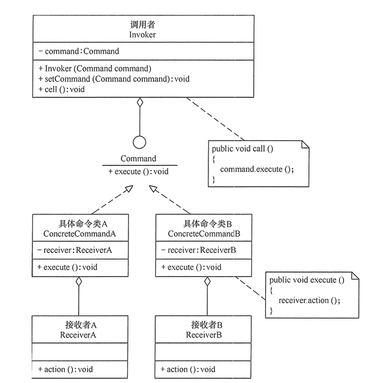
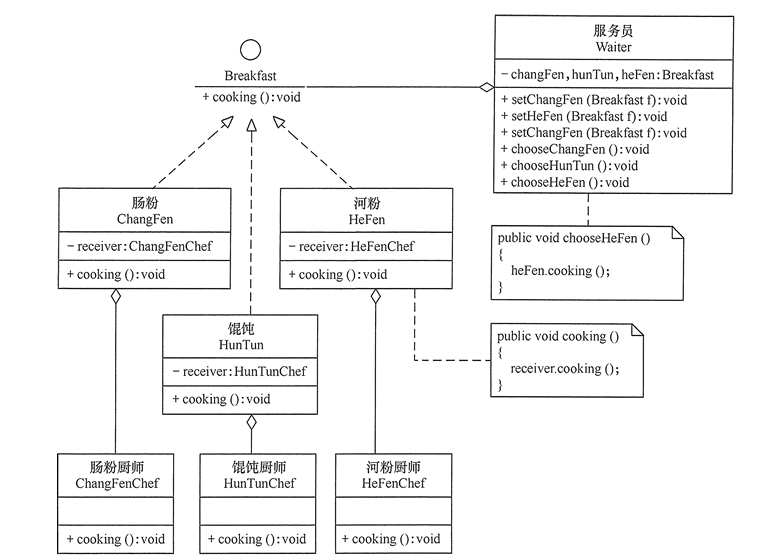
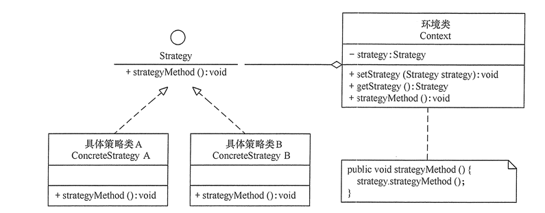
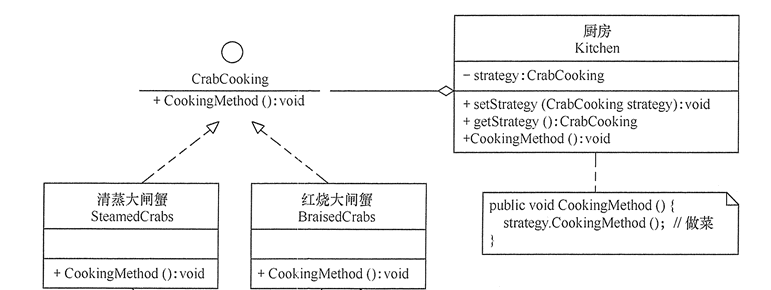

# 命令模式和策略模式

> @author huangdailin on 2019/8/6
>

## 命令模式

### 定义：

命令模式定义：将一个请求封装为一个对象，使发出请求的责任和执行请求责任分割开。这样两者之间通过命令对象进行沟通，方便将命令对象进行存储、传递、增加和管理。

### 结构与实现：

可以将系统中的相关操作抽象为命令，使调用者与实现者相关分离。

1. **模式的结构**

   命令模式包含以下主要角色。

   - 抽象命令类角色：声明执行命令的接口。拥有执行命令的抽象方法`execute()`;
   - 具体命令角色：是抽象命令类的具体实现类，拥有接收者对象，并通过调用者的功能来完成命令要执行的操作；
   - 实现者/接收者角色：执行命令功能的相关操作，是具体命令对象业务的真正实现者；
   - 调用者/请求者角色：是请求的发送者，通常拥有很多的命令对象，并通过访问命令对象来执行相关请求，不能直接访问接收者。

结构图：



**实例**

客人去餐馆可选择的早餐有肠粉、河粉和馄饨等，客人可向服务员选择以上早餐中的若干种，服务员将客人的请求交给相关的厨师去做。这里的点早餐相当于“命令”，服务员相当于“调用者”，厨师相当于“接收者”，所以用命令模式实现比较合适。

首先，定义一个早餐类（`Breakfast`），它是抽象命令类，有抽象方法 `cooking()`，说明要做什么；再定义其子类肠粉类（`ChangFen`）、馄饨类（`HunTun`）和河粉类（`HeFen`），它们是具体命令类，实现早餐类的 `cooking()` 方法，但它们不会具体做，而是交给具体的厨师去做；具体厨师类有肠粉厨师（`ChangFenChef`）、馄饨厨师（`HunTunChef`）和河粉厨师（`HeFenChef`），他们是命令的接收者，结构图如下：



**实现代码：**

调用者：服务员

```java
public class Waiter {
    private Breakfast changfen, huntun, hefen;

    public void setChangfen(Breakfast changfen) {
        this.changfen = changfen;
    }

    public void setHuntun(Breakfast huntun) {
        this.huntun = huntun;
    }

    public void setHefen(Breakfast hefen) {
        this.hefen = hefen;
    }

    public void chooseChangFen() {
        changfen.cooking();
    }

    public void chooseHunTun() {
        huntun.cooking();
    }

    public void chooseHeFen() {
        hefen.cooking();
    }
}

```

抽象命令：早餐类

```Java
interface Breakfast {

    public abstract void cooking();
}
```

具体命令类

```java
/**
 * 肠粉类
 */
public class ChangFen implements Breakfast {

    private ChangFenChef changFenChef;
    ChangFen(){
        changFenChef = new ChangFenChef();
    }
    @Override
    public void cooking() {
        changFenChef.cooking();
    }
}
/**
 * 河粉类
 */
public class HeFen implements Breakfast {
    private HeFenChef heFenChef;
    HeFen(){
        heFenChef = new HeFenChef();
    }

    @Override
    public void cooking() {
        heFenChef.cooking();
    }
}
/**
 * 馄饨类
 */
public class HunTun implements Breakfast {
    private HunTunChef hunTunChef;
    HunTun(){
        hunTunChef = new HunTunChef();
    }
    @Override
    public void cooking() {
        hunTunChef.cooking();
    }
}
```

接收者

```java
/**
 * 肠粉厨师类
 */
public class ChangFenChef {
    public void cooking() {
        System.out.println("煮肠粉！！");
    }
}
/**
 * 河粉厨师
 */
public class HeFenChef {
    public void cooking(){
        System.out.println("煮河粉！！");
    }
}
/**
 * 馄饨厨师
 */
public class HunTunChef {
    public void cooking(){
        System.out.println("煮馄饨！！");
    }
}
```

### 命令模式的应用场景

命令模式通常适用于以下场景。

1. 当系统需要将请求调用者与请求接收者解耦时，命令模式使得调用者和接收者不直接交互。
2. 当系统需要随机请求命令或经常增加或删除命令时，命令模式比较方便实现这些功能。
3. 当系统需要执行一组操作时，命令模式可以定义宏命令来实现该功能。
4. 当系统需要支持命令的撤销（`Undo`）操作和恢复（`Redo`）操作时，可以将命令对象存储起来，采用备忘录模式来实现。

### 命令模式的优缺点

命令模式的主要优点如下。

1. 降低系统的耦合度。命令模式能将调用操作的对象与实现该操作的对象解耦。
2. 增加或删除命令非常方便。采用命令模式增加与删除命令不会影响其他类，它满足“开闭原则”，对扩展比较灵活。
3. 可以实现宏命令。命令模式可以与组合模式结合，将多个命令装配成一个组合命令，即宏命令。
4. 方便实现 `Undo` 和 `Redo` 操作。命令模式可以与备忘录模式结合，实现命令的撤销与恢复。

其缺点是：可能产生大量具体命令类。因为对每一个具体操作都需要设计一个具体命令类，这将增加系统的复杂性。

---

## 策略模式

### 定义：

该模式定义了一系列算法，并将每个算法封装起来，使它们可以相互替换，且算法的变化不会影响使用算法的客户。策略模式属于对象行为模式，它通过对算法进行封装，把使用算法的责任和算法的实现分割开来，并委派给不同的对象对这些算法进行管理。

### 结构与实现

**策略模式的结构**

策略模式的主要角色如下。

1. 抽象策略（`Strategy`）类：定义了一个公共接口，各种不同的算法以不同的方式实现这个接口，环境角色使用这个接口调用不同的算法，一般使用接口或抽象类实现。
2. 具体策略（`Concrete Strategy`）类：实现了抽象策略定义的接口，提供具体的算法实现。
3. 环境（`Context`）类：持有一个策略类的引用，最终给客户端调用。

**结构图**：



**实例**

  分析：关于大闸蟹的做法有很多种，我们以清蒸大闸蟹和红烧大闸蟹两种方法为例，介绍策略模式的应用。

首先，定义一个大闸蟹加工的抽象策略类（`CrabCooking`），里面包含了一个做菜的抽象方法 `CookingMethod()`；然后，定义清蒸大闸蟹（`SteamedCrabs`）和红烧大闸蟹（`BraisedCrabs`）的具体策略类，它们实现了抽象策略类中的抽象方法；  最后，定义一个厨房（`Kitchen`）环境类，它具有设置和选择做菜策略的方法；客户类通过厨房类获取做菜策略，结构图如下：



**实现代码：**

抽象策略类：大闸蟹加工类

```java
public interface CrabCooking {
    //做菜方法
    public void CookingMethod();
}
```

具体策略类

```java
/**
 * 具体策略类：红烧大闸蟹
 */
public class BraisedCrabs implements CrabCooking {
    @Override
    public void CookingMethod() {
        System.out.println("红烧大闸蟹！");
    }
}
/**
 * 具体策略类：清蒸大闸蟹
 */
public class SteamedCrabs implements CrabCooking {
    @Override
    public void CookingMethod() {
        System.out.println("清蒸大闸蟹！");
    }
}
```

环境类

```java
/**
 * 环境类：厨房
 */
public class Kitchen {
    //抽象策略
    private CrabCooking crabCooking;

    public void setCrabCooking(CrabCooking crabCooking) {
        this.crabCooking = crabCooking;
    }

    public CrabCooking getCrabCooking() {
        return crabCooking;
    }
    public void CookingMethod(){
        //做菜
        crabCooking.CookingMethod();
    }
}
```

### 策略模式的应用场景

1. 一个系统需要动态地在几种算法中选择一种时，可将每个算法封装到策略类中。
2. 一个类定义了多种行为，并且这些行为在这个类的操作中以多个条件语句的形式出现，可将每个条件分支移入它们各自的策略类中以代替这些条件语句。
3. 系统中各算法彼此完全独立，且要求对客户隐藏具体算法的实现细节时。
4. 系统要求使用算法的客户不应该知道其操作的数据时，可使用策略模式来隐藏与算法相关的数据结构。
5. 多个类只区别在表现行为不同，可以使用策略模式，在运行时动态选择具体要执行的行为。

### 策略模式的优缺点

策略模式的主要优点如下。

1. 多重条件语句不易维护，而使用策略模式可以避免使用多重条件语句。
2. 策略模式提供了一系列的可供重用的算法族，恰当使用继承可以把算法族的公共代码转移到父类里面，从而避免重复的代码。
3. 策略模式可以提供相同行为的不同实现，客户可以根据不同时间或空间要求选择不同的。
4. 策略模式提供了对开闭原则的完美支持，可以在不修改原代码的情况下，灵活增加新算法。
5. 策略模式把算法的使用放到环境类中，而算法的实现移到具体策略类中，实现了二者的分离。


其主要缺点如下。

1. 客户端必须理解所有策略算法的区别，以便适时选择恰当的算法类。
2. 策略模式造成很多的策略类。

---

## 命令模式与策略模式区别

应用场景不同：

```
命令模式通常用于使用不同命令做不同的事。
策略模式通常用于使用不同的策略方法做相同的事。
```

- 策略模式：定义算法族，分别封装起来，让他们之间可以互相替换，此模式让算法的变化独立于使用算法的客户。在同一场景下，多种算法选择一种来实现即可。

- 命令模式：将请求封装成对象，这可以让你使用不同的请求、队列，或者日志请求来参数化其他对象。命令模式也可以支持撤销操作。可能有多个命令，在实际工作中，可能是要先后执行的。

策略模式对付的问题域通常是一个，就是说，多个策略只是处理同一个问题，而命令模式对付的是多个问题域，就是很多不同的命令来做不同的事情。

假设是老鹰，飞的时候要按照一套算法完成：一飞冲天、翱翔、盘旋，假设这分别是3种飞行算法，那么这算什么模式？
我觉得，对老鹰来说，这就是策略模式；对飞行算法来说，可能是命令模式。

